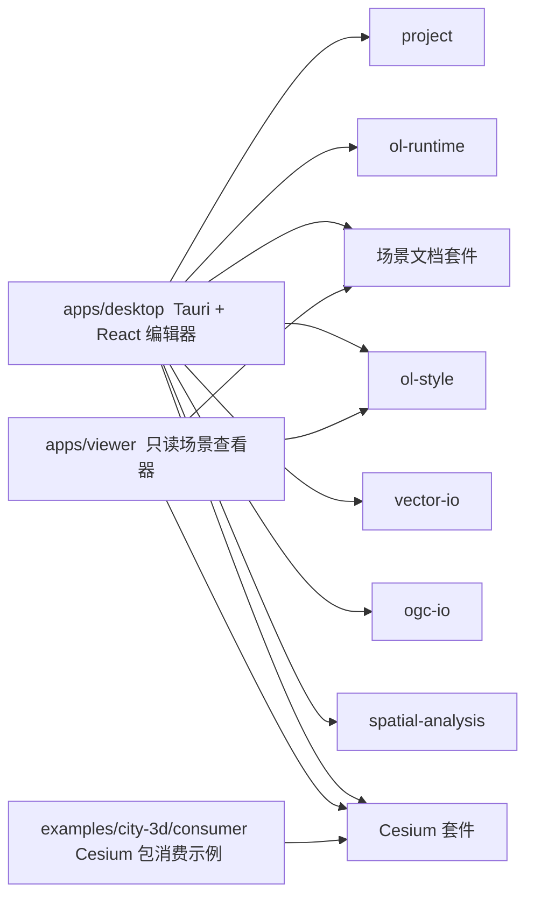

# Application overview

```mermaid
flowchart LR
  desktop["apps/desktop  Tauri + React 编辑器"]
  viewer["apps/viewer  只读场景查看器"]
  example["examples/city-3d/consumer  Cesium 包消费示例"]
  project["project"]
  olRuntime["ol-runtime"]
  sceneKit["场景文档套件"]
  olStyle["ol-style"]
  vectorIo["vector-io"]
  ogcIo["ogc-io"]
  spatial["spatial-analysis"]
  cesiumKit["Cesium 套件"]
  desktop --> project
  desktop --> olRuntime
  desktop --> sceneKit
  desktop --> olStyle
  desktop --> vectorIo
  desktop --> ogcIo
  desktop --> spatial
  desktop --> cesiumKit
  viewer --> sceneKit
  viewer --> olStyle
  viewer --> cesiumKit
  example --> cesiumKit
```
