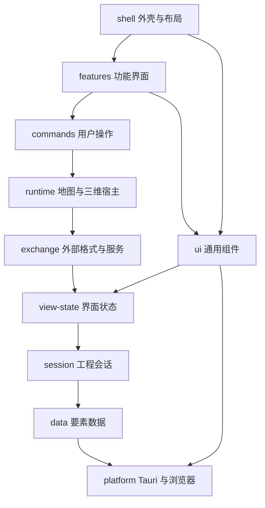

# Layered architecture regression

```mermaid
flowchart TB
  shell["shell 外壳与布局"]
  features["features 功能界面"]
  commands["commands 用户操作"]
  runtime["runtime 地图与三维宿主"]
  exchange["exchange 外部格式与服务"]
  viewState["view-state 界面状态"]
  session["session 工程会话"]
  data["data 要素数据"]
  platform["platform Tauri 与浏览器"]
  ui["ui 通用组件"]
  shell --> features
  features --> commands
  commands --> runtime
  runtime --> exchange
  exchange --> viewState
  viewState --> session
  session --> data
  data --> platform
  shell --> ui
  features --> ui
  ui --> viewState
  ui --> platform
```
