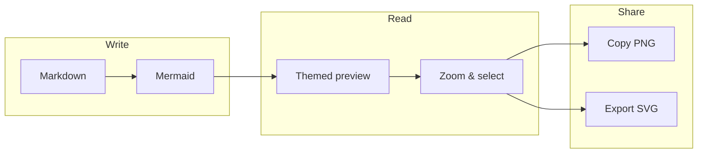

# Mermaid Flair quick start

```mermaid
flowchart LR
  subgraph write[Write]
    A[Markdown] --> B[Mermaid]
  end
  subgraph read[Read]
    C[Themed preview] --> D[Zoom & select]
  end
  subgraph share[Share]
    E[Copy PNG]
    F[Export SVG]
  end
  B --> C
  D --> E
  D --> F
```
