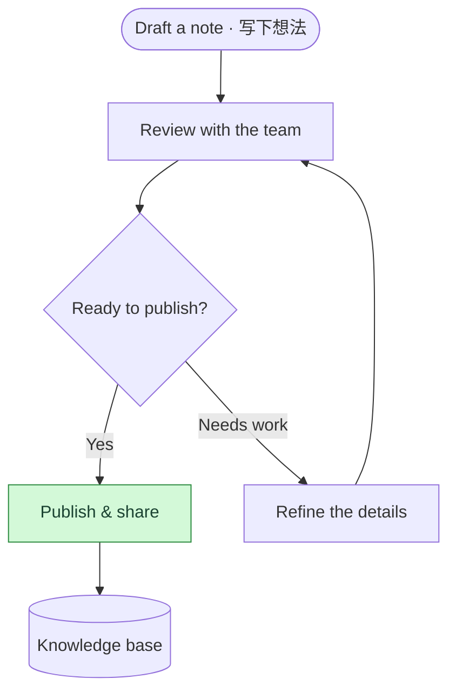

# Sketch whiteboard sample

```mermaid
flowchart TD
  A(["Draft a note · 写下想法"]) --> B["Review with the team"]
  B --> C{"Ready to publish?"}
  C -->|Yes| D["Publish & share"]
  C -->|Needs work| E["Refine the details"]
  E --> B
  D --> F[("Knowledge base")]
  classDef published fill:#d3f9d8,stroke:#2b8a3e,color:#1b4332
  class D published
```
